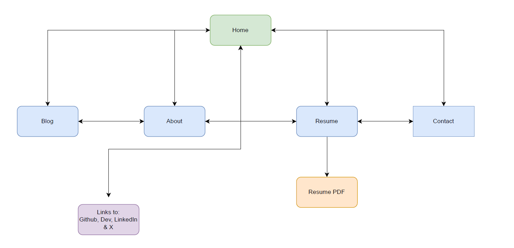

# T1A2 Portfolio Assignement

#### Philip Mills

[Github Repository](https://github.com/Bearamonium/Portfolio-T1A2)

[Presentation](https://youtu.be/aJAhkKjDPiY)

[Website](https://philip-mills-portfolio.netlify.app/)

## Purpose

As per the assignement guidelines, this website aims to present myself as a web and IT professional to possible recruiters within the IT field. The website itself aims to provide informaiton about myself, my work experiences and my goals/skills. 

## Design Process  

The finished product is a website that caters to responsive design, which was built upon a mobile-first perspective. There are 4 main media breakpoints which are outlined in my SCSS files. I believe that the HTML elements themselves are within the Semantic HTML guidelines, however `
` is used throughout the code to utlize more formatting using my media breakpoints. 

I had a bit of issues with the original design - once completed it really came across as this psuedo 90's look which wasn't what I was aiming for. This irked me to create a more modern design, utlizing opaic backgrounds using `::before` to bring the pages to life rather than just being plain. 

All professional links are contained within the footer, which is on each of my pages. 

The site itself includes 5 main pages, with an additional page for my resume PDF - Sitemap included below. 

## Wireframes / View Screenshots

### Home Page

### About Page

 

### Blog Page

 

### Resume Page

### Contact Page

### Resume PDF Link

## Target Audience

This page was designed for potential employers with IT knowledge. These employers are then drawn using the website with information to hire a IT professional. 

## Tech Stack
* Sitemap: [draw.io](https://app.diagrams.net/)
* Wireframes: [Figma](https://www.figma.com/)
* Website Code: HTML & SCSS compiled into CSS
* Creation Platform: Visual Studio Code
* Website Deployment: [Netlify](https://www.netlify.com/)
* Version Control: [GitHub](https://github.com/)
* Slide Deck: Microsoft Powerpoint